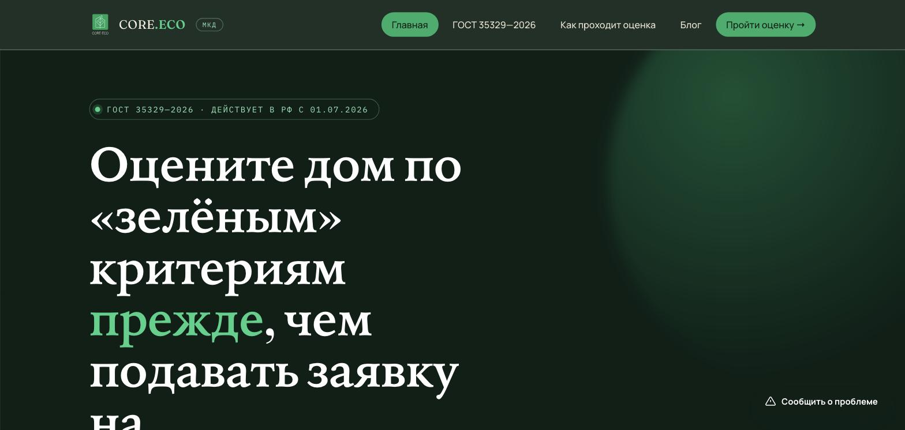
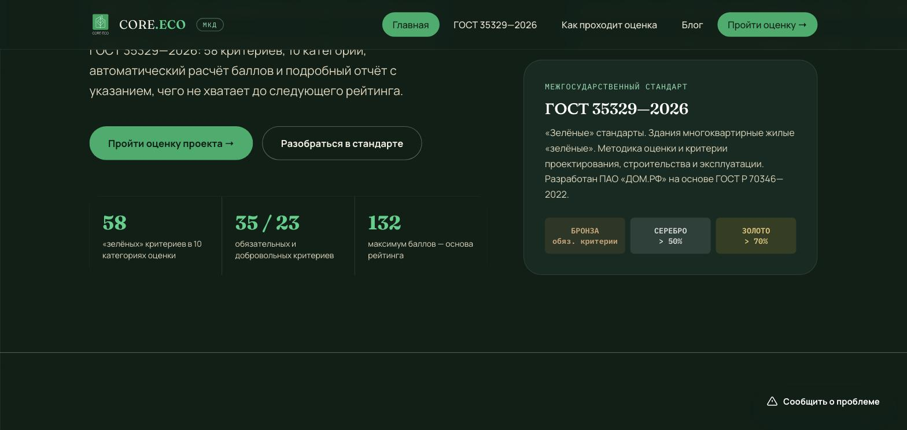
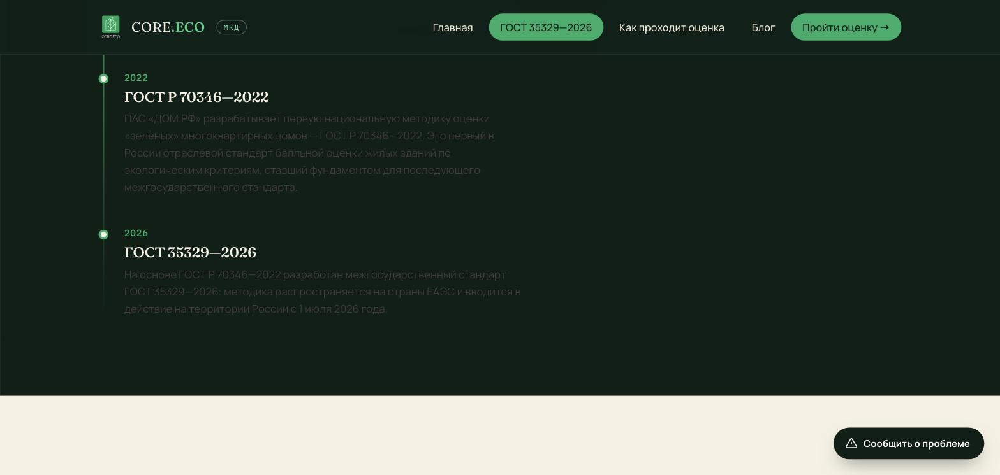
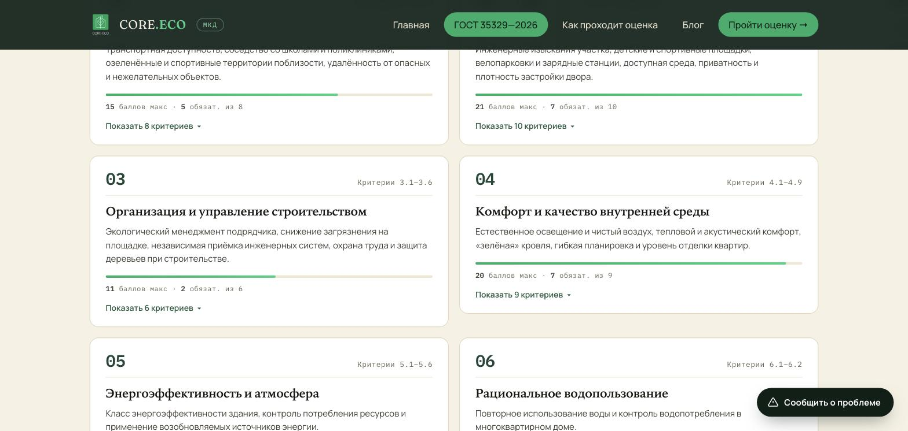
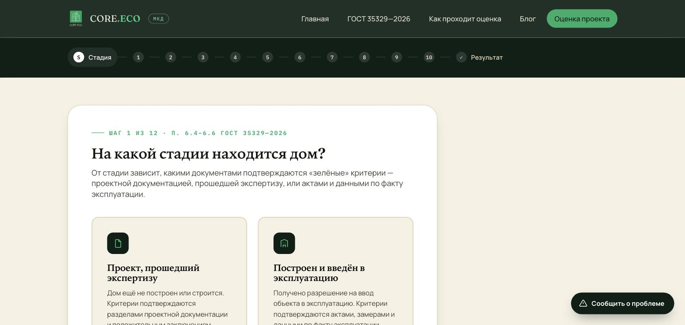
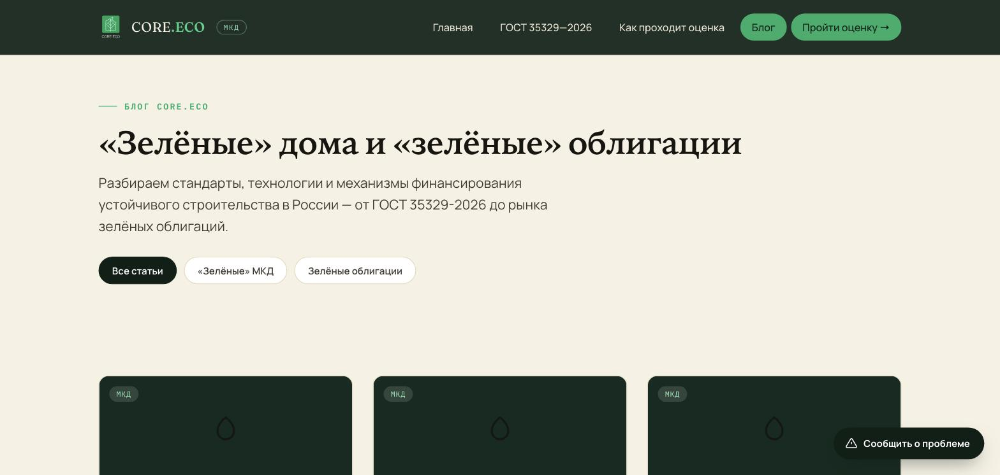

# CORE.ECO · МКД

Онлайн-инструмент самооценки многоквартирных домов по межгосударственному стандарту
**ГОСТ 35329—2026** «"Зелёные" стандарты. Здания многоквартирные жилые "зелёные".
Методика оценки и критерии проектирования, строительства и эксплуатации» (действует в РФ
с 01.07.2026, разработан ПАО «ДОМ.РФ» на основе ГОСТ Р 70346—2022).

**Живой сайт:** https://mkd.core-eco.ru/

## Что делает сайт

- **Мастер оценки** (`assessment.html`) — пошагово проводит по всем 58 критериям ГОСТ
  35329—2026 (10 категорий: расположение и транспорт, экология участка, организация
  строительства, комфорт среды, энергоэффективность, водопользование и др.), автоматически
  считает баллы и определяет рейтинг — **Бронза / Серебро / Золото**.
- **Гео-проверка критериев 1.1–1.8** — расположение объекта проверяется через открытые
  сервисы OpenStreetMap (Nominatim + Overpass, с резервным зеркалом и таймаутом), адрес
  можно ввести с подсказками через DaData.
- **Автосохранение сессии** — прогресс и загруженные файлы хранятся в браузере пользователя
  (localStorage + IndexedDB), можно закрыть вкладку и вернуться позже.
- **PDF-отчёт результата** — печатная версия отчёта через системную печать браузера, без
  сторонних библиотек.
- **Блог** — 10 статей о «зелёном» строительстве и стандартизации МКД.
- Формы обратной связи и заявки на сертификацию — через Formspree.

## Скриншоты



| Главная — стандарт и цифры | Хронология стандарта |
|---|---|
|  |  |

| 10 категорий критериев | Мастер оценки |
|---|---|
|  |  |

| Блог |
|---|
|  |

## Технологии

Статический сайт: HTML / CSS / vanilla JS, без сборки и бэкенда.

- `assets/js/gost-data.js` — данные всех 58 критериев ГОСТ 35329—2026, сверены с текстом
  стандарта вручную.
- `assets/js/wizard.js` — логика мастера оценки и расчёт баллов (`computeScore()`).
- `assets/js/osm.js` — гео-проверка через OpenStreetMap (Nominatim/Overpass).
- `assets/js/dadata.js` — подсказки адреса через DaData.
- `assets/js/persistence.js` — автосохранение сессии (localStorage + IndexedDB).

## Структура

```
core-eco-mkd/
├── index.html          — главная страница
├── assessment.html     — мастер оценки
├── blog/                — статьи блога
├── pitch/                — презентация возможностей сайта
├── assets/
│   ├── css/style.css
│   └── js/               — gost-data.js, wizard.js, osm.js, dadata.js, persistence.js, config.js
└── .claude/skills/       — Claude Code skill проекта (см. ниже)
```

## Claude Code Skill

В `.claude/skills/gost-35329-expert/` опубликован skill-эксперт по ГОСТ 35329—2026: помогает
разбирать структуру критериев и методику балльной оценки стандарта, сверять данные критериев
в `assets/js/gost-data.js` с текстом ГОСТ, сопоставлять редакции ГОСТ 35329—2026 и
ГОСТ Р 70346—2022.
